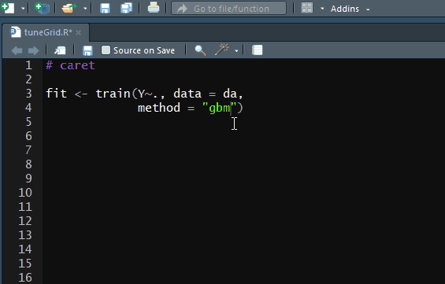

# caretTuneGrid Addin

### Overview

The `caretTuneGrid` is the RStudio addin for inserting tune parameters code in editor for the `caret` package. Inspiration for this addin is the chapter ["7 train Models By Tag"](http://topepo.github.io/caret/train-models-by-tag.html) in ["The caret Package"](http://topepo.github.io/caret/index.html), Max Kuhn. The `caret` package supports over 230 different models and this addin can help to easily setup tuning parameters for each model. 

### Installation
You can install the latest addin version from GitHub

```
devtools::install_github("milosvil/caretTuneGrid")
```

### Usage

- Step 1. Select method name in train function.

- Step 2. Run addin


